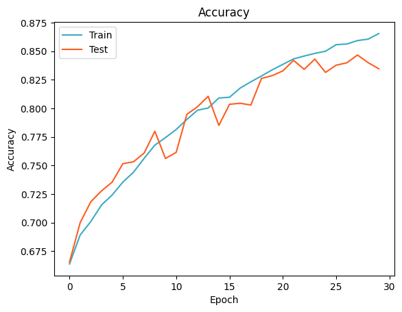
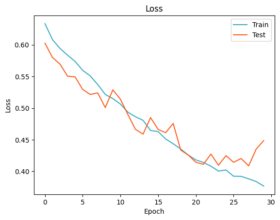
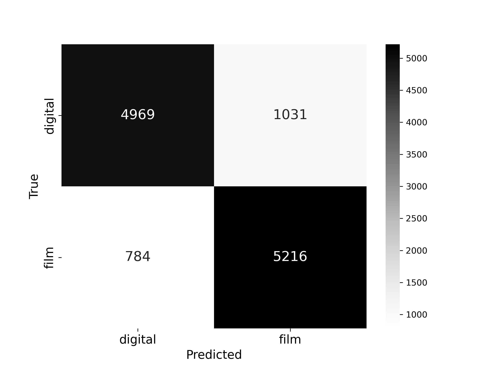
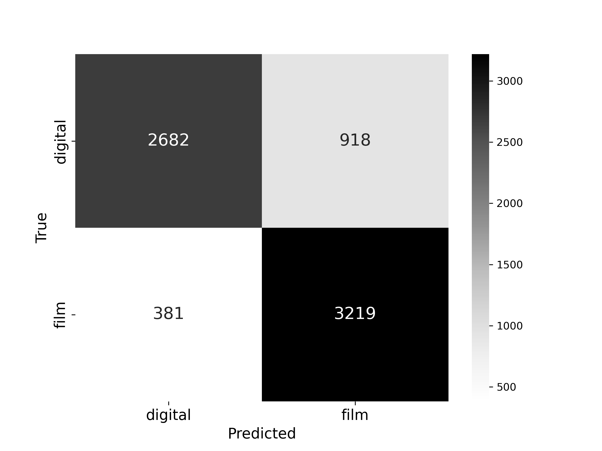

# Film vs. Digital Photo Classifier

## Image Classification Based on Photo Origin

## Overview
This project explores the visual characteristics of photographs taken with film versus digital cameras using a binary image classification model. The goal is to train a deep learning model that accurately classifies images as either film or digital based solely on visual characteristics.

A convolutional neural network (CNN) was developed and deployed through a Streamlit web application, enabling users to upload a photo and receive a prediction with a Grad-CAM heatmap for interpretability.

## Feature Objectives
While the model functions as a black box, certain stylistic and technical characteristics likely influence its classification decisions. 
Based on domain knowledge and image curation experience, the following features were hypothesized to be distinguishing factors between film and digital photographs:

- **Grain vs. Noise Texture**: Film images often contain irregular organic grain patterns, while digital photos may exhibit more uniform sensor noise
- **Dynamic Range and Highlight Roll-off**: Film typically handles highlights more softly, with smoother roll-off and less abrupt clipping compared to digital sensors.
- **Color Rendition**: Film photos often exhibit warmer tones or distinctive color shifts (e.g., greens in Kodak Gold, reds in Portra), whereas digital images may present more clinical or true-to-life colors.
- **Sharpness and Detail**: Digital images—especially from modern sensors—tend to be sharper and more crisp  than film, which may appear softer.
- **Bokeh Quality**: Bokeh characteristics such as shape, quality, and texture may differ in film and digital images due to hardware differences such as lense evolutions. 
- **Other Artifacts**: Light leaks and halos are common artifacts in scanned film. While digital photos may be more subject to moiré, aliasing, and rolling shutter.

While Grad-CAM visualizations help identify image regions the model attends to, they do not explicitly confirm which features are being used. These hypotheses provide a framework for interpreting both model behavior and potential misclassifications.

## Data Dictionary
| Feature       | Type    | Description                                                  |
|---------------|---------|--------------------------------------------------------------|
| Image         | jpeg    | RGB image of arbitrary dimension                            |
| Label         | string  | Classification label: 'film' or 'digital'                   |

## Executive Summary
This project was completed in five phases:

- **Data Collection**: Images were collected from Flickr groups using the Flickr API.
- **Preprocessing**: Images were cropped and resized uniformly, then split into training and validation sets.
- **Modeling**: A custom CNN architecture was trained with early stopping and L2 regularization.
- **Evaluation**: Model performance was assessed using accuracy, loss curves, and confusion matrices.
- **Deployment**: A Streamlit app was developed to allow users to upload photos and view predictions with Grad-CAM visualizations.

The model reached a validation accuracy of approximately 84.7%.

## Data Collection
Images were collected from public Flickr groups:
- https://www.flickr.com/groups/filmdatabase/
- https://www.flickr.com/groups/digitalp/

Using the Flickr API, roughly 60,000 images (30,000 per class) were downloaded. Duplicate and broken images were excluded via ID logging and exception handling.

## Data Preprocessing
Images were processed using a custom `crop_resize` function that:
- Maintains aspect ratio
- Resizes to 700x700 pixels
- Normalizes pixel values to [0, 1]

The dataset was randomly split 80/20 into training and validation folders by class.

## Model Architecture
A custom Convolutional Neural Network was implemented using Keras.

| Layer              | Details                             |
|--------------------|-------------------------------------|
| Conv2D (32 filters) + MaxPooling | 3x3 filter         |
| Conv2D (64 filters) + MaxPooling | 2x2 filter         |
| Conv2D (128 filters) + MaxPooling| 3x3 filter         |
| Conv2D (256 filters) + MaxPooling| 1x1 and 2x2 filters|
| Dense (64 units) + Dropout       | L2 regularized     |
| Output Layer                     | Sigmoid            |

Training:
- Loss Function: Binary Crossentropy
- Optimizer: Adam
- Epochs: 30
- Batch Size: 32
- Callbacks: EarlyStopping, ModelCheckpoint

## Model Evaluation
Training progress was monitored over 30 epochs using validation accuracy and loss.

- **Validation Accuracy**: ~84.7%
- **Validation Loss**: ~0.41

### Accuracy Plot

### Loss Plot

### Confusion Matrix – Test Set

This confusion matrix reflects the model’s performance on the held-out **test set** from the original Flickr-sourced dataset (20% of 60,000 images total).

- **Recall for film images**: **86.9%**
- **Recall for digital images**: **82.8%**

The model demonstrates balanced performance, with a slight edge in identifying film images. This suggests that the model generalized well on the testing data, although some digital photos, potentially with film-like characteristics, were misclassified.

---

### Confusion Matrix – Serving Set

A **serving set** was curated using personal film and digital photographs to assess real-world generalization beyond the training and test domains.

- **Recall for film images**: **89.4%**
- **Recall for digital images**: **74.5%**

The model performed especially well on film images in this real-world set, likely due to the strong stylistic consistency of the images in the set. However, digital images showed lower recall, possibly due to greater stylistic variability. 

## Streamlit App

The model is deployed via Streamlit at:
https://film-detective.streamlit.app/

### Features:
- Upload an image in JPG format
- Classify it as "film" or "digital"
- View a Grad-CAM heatmap overlay that highlights important regions

## Conclusion

This project demonstrates the potential of CNNs in distinguishing between film and digital images based on visual patterns alone. Despite the black-box nature of deep learning, Grad-CAM and performance analysis suggest the model has learned meaningful cues related to the stylistic differences in film and digital photography. Future improvements could involve training on a wider variety of devices, film stocks, and post-processing styles to further improve generalization.

